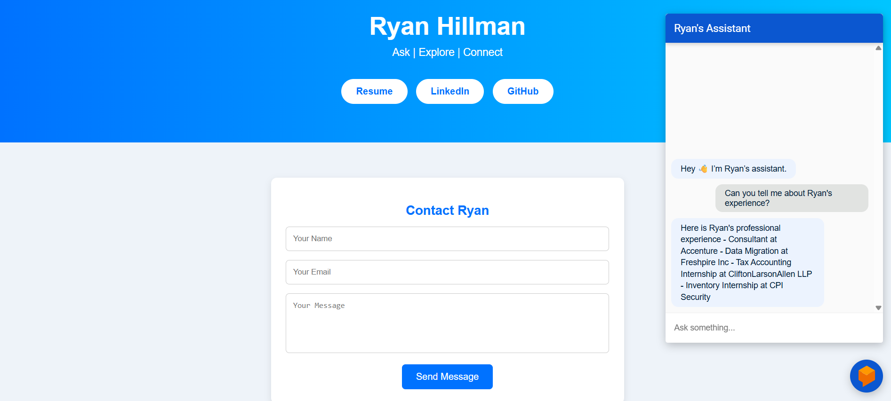

# Resume Chatbot

  
  

This project allows visitors to explore my professional background with a chatbot.

---

## [Demo](https://youtu.be/_BYi5aOAlco)

---

## Features
- Google Dialogflow ES: Handles intents like skills, programming languages, and small talk.
- Webhook (Python/Flask on Google Cloud Run): Pulls information from my resume on a JSON file in Google Cloud Storage.
- Chatbot embedded using Dialogflow Messenger.
- Links to a PDF version of my resume, LinkedIn, and GitHub.
- Contact Form implemented with [Formspree](https://formspree.io).
- GitHub Pages for static site hosting.
- Frontend designed with HTML5, CSS3, and lightweight JavaScript.

---

## Screenshot

