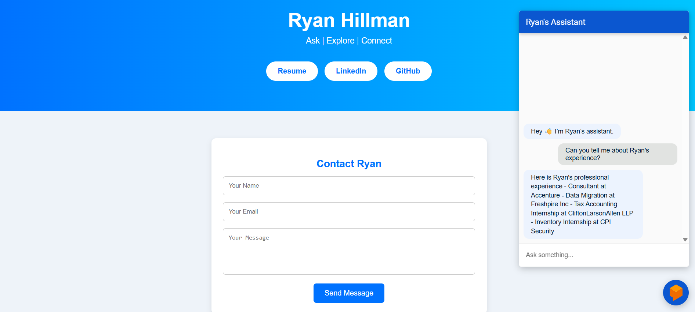

# Resume Chatbot

<p align="center">
  
  
</p>

This project allows visitors to explore my professional background with a chatbot.

---

## [Demo](https://youtu.be/-dResrRCJoQ)

---

## Screenshot



---

## Features
- Google Dialogflow ES: Handles intents like skills, programming languages, and small talk.
- Webhook (Flask on Cloud Run): Retrieves resume info from a JSON file in Cloud Storage.
- Chatbot embedded using Dialogflow Messenger.
- Links to a PDF version of my resume, LinkedIn, and GitHub.
- Contact Form implemented with [Formspree](https://formspree.io).
- GitHub Pages for static site hosting.
- Frontend designed with HTML5, CSS3, and lightweight JavaScript.

---

## How to Run

### Backend

```bash
cd backend
pip install -r requirements.txt
python main.py
```

The Flask webhook will run locally at `http://localhost:8080`.

### Frontend

The frontend is a standalone `index.html` page. It can be opened locally or hosted through GitHub Pages.

---

Please see the linked demo for an overview of deployment.
